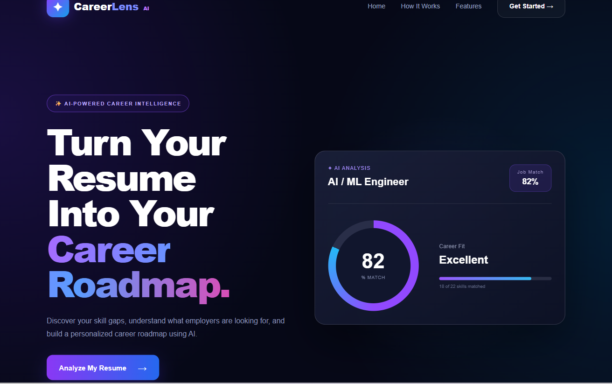

# 🚀 CareerLens AI
## 🌐 Live Demo

👉 [CareerLens AI – Live Website](https://career-lens-ai-iota.vercel.app/)

### AI-Powered Resume & Career Analysis Platform

CareerLens AI is an AI-powered web application that analyzes a user's resume against a target job role and provides personalized career insights.

It helps users understand their current skill match, identify missing skills, explore suitable career paths, and receive recommendations for improving their resume and career profile.

---

## ✨ Features

- 📄 Resume analysis
- 🎯 Target job role matching
- 📊 Resume-to-job match percentage
- ✅ Matched skills identification
- ❌ Missing skills identification
- 🧭 Career roadmap generation
- 💡 Personalized recommendations
- 💼 Job suitability analysis
- 📈 Career fit evaluation
- 🔄 Resume analysis restart option
- 🎨 Modern and responsive user interface

---

## 🛠️ Technologies Used

### Frontend

- React.js
- Vite
- JavaScript
- HTML5
- CSS3

### Backend

- Node.js
- Express.js

### AI / Data Processing

- AI-based resume analysis
- Skill matching
- Career recommendation logic
- Resume-to-job comparison

### Development Tools

- Visual Studio Code
- Git
- GitHub
- npm

---

## 🏗️ Project Structure

```text
CareerLens-AI/
│
├── backend/
│   ├── uploads/
│   ├── package.json
│   ├── package-lock.json
│   └── server.js
│
├── frontend/
│   ├── public/
│   ├── src/
│   │   ├── assets/
│   │   ├── pages/
│   │   │   ├── Analyzer.jsx
│   │   │   ├── Analyzer.css
│   │   │   ├── Results.jsx
│   │   │   └── Results.css
│   │   ├── App.jsx
│   │   ├── App.css
│   │   ├── index.css
│   │   └── main.jsx
│   │
│   ├── package.json
│   └── vite.config.js
│
├── .gitignore
└── README.md
```


## 📸 Project Preview


